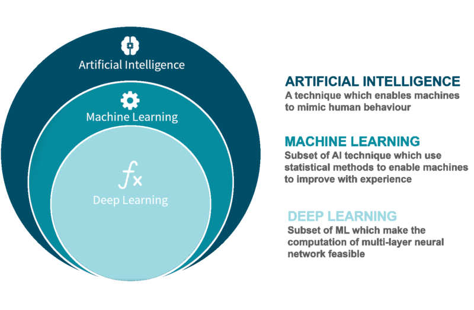

# Machine Learning for non data scientists
## 0. The basics
Some definitions before we get started ...

### Artificial intelligence (AI)
> Artificial intelligence (AI) is wide-ranging branch of computer science concerned with building smart machines capable of performing tasks that typically require human intelligence. 
[src](https://builtin.com/artificial-intelligence)

### Machine learning (ML)
> Machine learning is an application of artificial intelligence (AI) that provides systems the ability to automatically learn and improve from experience without being explicitly programmed.
[src](https://www.expert.ai/blog/machine-learning-definition/)

<!-- > Machine Learning is the study of computer algorithms that improve automatically through experience.
[src](http://www.cs.cmu.edu/afs/cs.cmu.edu/user/mitchell/ftp/mlbook.html) -->

### Deep learning
> Deep learning is an artificial intelligence (AI) function that imitates the workings of the human brain in processing data and creating patterns for use in decision making. Deep learning is a subset of machine learning.
[src](https://www.investopedia.com/terms/d/deep-learning.asp)

### Neural network
[3Blue1Brown](https://www.youtube.com/watch?v=aircAruvnKk&list=PLZHQObOWTQDNU6R1_67000Dx_ZCJB-3pi)'s youtube channel does a great job in explaining neural networks for those who wanna dive deeper.

### How are these terms related?
The terms Machine learning and Artificial intelligence are often used interchangeably, but that is not correct. ML is a subset of AI. [Symbolic AI](https://medium.com/@vbanda/good-old-fashioned-artificial-intelligence-b60800313dee) (or rule based AI or Good Old-Fashioned AI) is another subset of AI, and it does not make use of ML.

[src](https://www.gabo.de/kuenstliche-intelligenz-vs-machine-learning-definition-und-abgrenzung/)

### Different approaches for different use cases
#### Supervised learning
> Supervised learning is the machine learning task of learning a function that maps an input to an output based on example input-output pairs.

e.g. classification, regression

#### Unsupervised learning
> Unsupervised Learning is a machine learning technique in which the users do not need to supervise the model. Instead, it allows the model to work on its own to discover patterns and information that was previously undetected. It mainly deals with the unlabelled data.

e.g. clustering

#### Reinforcement learning
> Reinforcement Learning(RL) is a type of machine learning technique that enables an agent to learn in an interactive environment by trial and error using feedback from its own actions and experiences. ..

e.g. AlphaGo

## 1. Wekinator
[Wekinator](http://www.wekinator.org/) is real-time, interactive machine learning tool developed by [Rebecca Fiebrink](https://www.doc.gold.ac.uk/~mas01rf/homepage/).
Wekinator "just" does the machine learning task of a system. It does not sense, process or visualize data. Instead it makes use of the OSC protocol to receive and send data. Based on that incoming data, Wekinator trains a model, which then can be used to perform machine learning algorithms, such as classification or gesture recognition. 
Wekinator acts as the brain of a machine learning system. Input and output has to be handled externally. 

### OSC - Open Sound Control
OSC is a network based communication protocol. It is build on top of the UPD protocol. Since UPD does not send an acknowledgement package, it is very fast, but data could be lost. OSC/UPD is very often used for time critical applications, such as musical software tools or interaction installations. 
OSC is widely used and almost every creative coding frameworks either has direct support for OSC or offers libraries and plugins to communicate via OSC.
* [processing: OSC P5](http://www.sojamo.de/libraries/oscP5/)
* [openFrameworks: ofxOsc](https://github.com/openframeworks/openFrameworks/tree/master/addons/ofxOsc)
* [arduino: CNMAT/OSC](https://github.com/CNMAT/OSC)

[ofOSCDebugger](https://github.com/thomasgeissl/ofOSCDebugger) might be useful for debugging OSC communications.

OSC runs typically on top of UPD, hence it is not suitable for browser applications. In very raw cases OSC can be sent on top of TCP or serial (SLIP encoding), but this is not very widely supported.

### I/O
Wekinator provides examples for camera, audio, mouse input, and many more. At the time of writing, some of them are already outdated, but it is relatively simple to write your own custom input and output software.
A list of examples can be found [here](http://www.wekinator.org/examples/)

### Algorithms
Amongst others, Wekinator does classification, Regression, and dynamic time warping (gesture recognition) based on your custom trained models.

### Tutorials
* [getting started](https://www.youtube.com/watch?v=dPV-gCqy9j4)
* [manual](http://www.wekinator.org/detailed-instructions/)
* classification - [webcam drum machine](https://www.youtube.com/watch?v=NKyyBAKrQgE)
* dynamic time warping - [mouse gesture recognition](https://www.youtube.com/watch?v=J4viXTThDTE)
* [regression](https://www.youtube.com/watch?v=4lxGh0jQWBo)
* more videos can be found on Wekinator's [youtube channel](https://www.youtube.com/channel/UCot7vfr_9hTy2qp3ksTxGmg/videos)

## 2. Runway
[runwayml](https://runwayml.com/) is a commercial tool which makes it easy to use machine learning algorithms, without spending ages setting up the environment. It comes with a big selection of pretrained models, e.g. yolo, posenet or stylegan. Runway offers different interfaces - OSC, http and socket.io. Wekinator communicates in a similar way.

Runway will give you 10$ GPU credit on registration, that should be enough for this course, but please have in mind that every operation on their GPU will cost. Some models can be run locally or even in docker containers, those are free of charge.

### Installation
* On osx it can be installed via brew: `brew install --cask runway`
* On linux distributions it can be downloaded [here](https://support.runwayml.com/en/articles/3116268-runway-on-linux)
* There is also a [web version](https://app.runwayml.com/) available

### Tutorials
* [youtube channel](https://www.youtube.com/c/RunwayML/videos)
* [Coding Train](https://www.youtube.com/watch?v=ARnf4ilr9Hc)

## 3. Google Colab
Google Colab is quite a handy tool when it comes to run machine learning tasks in the cloud. It is compatible with [jupyter notebooks](https://jupyter.org/). With Colab you can create, collaborate with others and document machine learning projects. 
It is very powerful, but on the other hand it can be very overwhelming. It is relatively straight forward to run already existing demos, e.g. the ones from tensorflow hub. Those can be tweaked easily, e.g. changing parameters or asset urls. But writing a notebook from scratch is beyond the scope of this course.

Here are a couple of examples:
* [biggan](https://colab.research.google.com/github/tensorflow/hub/blob/master/examples/colab/biggan_generation_with_tf_hub.ipynb#scrollTo=dSAyfDfnVugs)
* [style transfer](https://colab.research.google.com/github/tensorflow/models/blob/master/research/nst_blogpost/4_Neural_Style_Transfer_with_Eager_Execution.ipynb)
* [pix2pix](https://colab.research.google.com/github/tensorflow/docs/blob/master/site/en/tutorials/generative/pix2pix.ipynb)

## 4. ml5
[ml5.js](https://ml5js.org/) is an easy to use machine learning library written in javascript. It uses tensorflow.js under the hood, abstracts away the complicated parts and provides and api which goes along very well with p5.js.
ml5.js bundles common pre-trained models. The "boring" tasks (data collection, data preparation, model traning) are already done. Using pre-trained models is very often suffcient - at least it is a good starting point. And since ml5 is based in tensorflow, we can use google's [teachable machine](https://teachablemachine.withgoogle.com/) to train a model ourselves. 

ml5 includes models for working with images/videos, sound and text.

The [reference page](https://learn.ml5js.org/#/reference/object-detector?id=examples) includes lots of interactive demos.

### Tutorials
* [coding train](https://www.youtube.com/playlist?list=PLRqwX-V7Uu6YPSwT06y_AEYTqIwbeam3y)